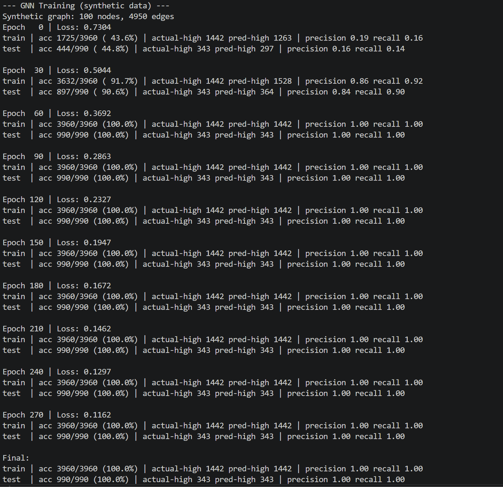
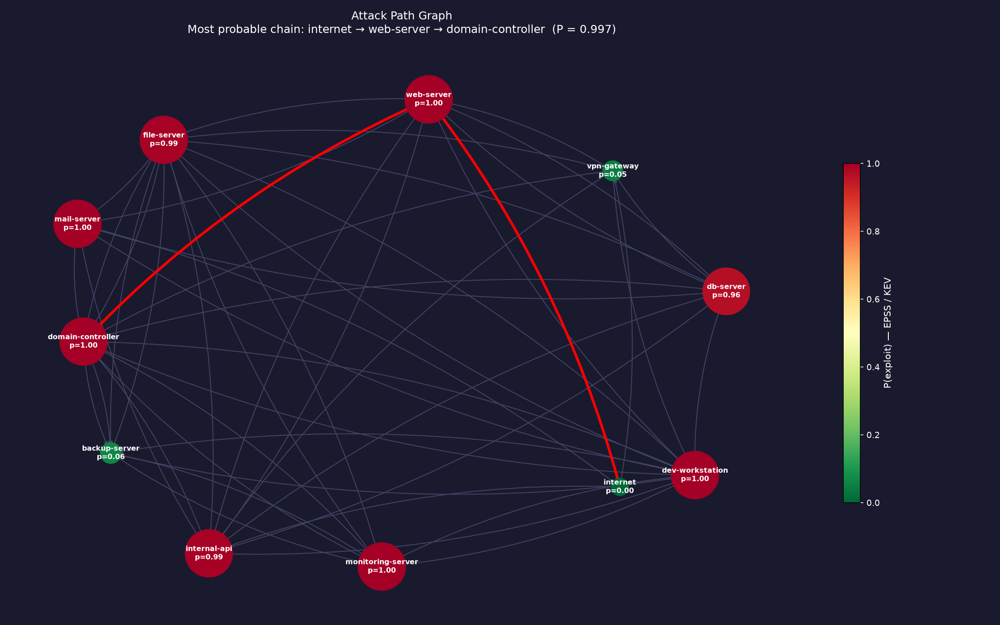

# Graph-Based Attack Path Modeler

A Python pipeline that ingests Nessus vulnerability scan data into a NetworkX graph model to map host-to-host attack paths based on exposed services and known CVEs. Includes a GNN classifier built with PyTorch Geometric and an interactive D3.js dashboard.

---

## Features

- **Nessus Parser** — ingests `.nessus` XML scan files and extracts hosts, CVEs, CVSS scores, ports, and services
- **Known-CVE Input** — no Nessus scan? Type in hosts + CVE IDs and the pipeline pulls real CVSS scores live from the [NVD API](https://nvd.nist.gov/developers), either from the terminal ([`main_from_cves.py`](main_from_cves.py)) or directly in the browser ([`builder.html`](builder.html))
- **Attack Graph** — builds a directed NetworkX graph where edges represent lateral movement paths between hosts, weighted by exploit ease (1/CVSS)
- **Cross-Subnet Modeling** — bridges network segments through any host marked as a gateway, for arbitrary topologies (not tied to one hardcoded subnet)
- **Path Analysis** — ranks all attack paths by cumulative risk score and identifies choke points using betweenness centrality
- **GNN Classifier** — PyTorch Geometric GCNConv model for edge-level high-risk lateral movement prediction
- **Matplotlib Visualization** — static attack graph with color-coded risk levels and highlighted attack paths
- **D3.js Dashboard** — interactive browser visualization with draggable nodes, hover tooltips showing CVE details, and highlighted attack chains

---

## Project structure
```
attack-path-modeler/
├── data/
│   ├── sample.nessus            # Sample Nessus scan data
│   ├── graph.json                # Exported graph for D3 dashboard (whichever pipeline ran last)
│   ├── known_hosts.json          # Example known-CVE spec — DMZ breach scenario
│   └── known_hosts_ivanti_vpn.json  # Example known-CVE spec — chained Ivanti VPN exploit
├── src/
│   ├── parser.py        # Nessus XML parser
│   ├── cve_lookup.py     # NVD API lookup — builds hosts from known CVE IDs
│   ├── graph.py           # NetworkX graph builder
│   ├── analysis.py        # Attack path ranking and choke point detection
│   ├── export.py          # JSON export for D3
│   ├── serve.py            # Local server + auto-opens the dashboard
│   └── gnn.py                # PyTorch Geometric GNN classifier
├── main.py               # Pipeline runner — Nessus scan input
├── main_from_cves.py     # Pipeline runner — known-CVE input (no Nessus needed)
├── dashboard.html        # Interactive D3.js visualization
├── builder.html          # Type hosts/CVEs in the browser, regenerates the graph live
└── requirements.txt
```

---

## Installation
```bash
pip install -r requirements.txt
```
Requirements: `networkx`, `matplotlib`, `torch`, `torch-geometric`

## Usage

**From a Nessus scan:**
```bash
python main.py
```
This will:
1. Parse `data/sample.nessus`
2. Build the attack graph
3. Find and display the highest risk attack path
4. Export `data/graph.json`
5. Train the GNN classifier on synthetic data

**From known CVEs, no Nessus scan required:**
```bash
python main_from_cves.py                    # uses data/known_hosts.json
python main_from_cves.py path/to/hosts.json  # or your own host/CVE spec
python main_from_cves.py --no-serve          # just export, skip auto-opening the dashboard
```
Edit `data/known_hosts.json` with your own hosts — just an IP, a list of CVE IDs, and `"role": "gateway"` on whatever bridges your network segments (firewall, VPN concentrator, jump host). Real CVSS scores are pulled live from the [NVD API](https://nvd.nist.gov/developers) and cached to `data/.cve_cache.json`, so re-runs are instant. New (uncached) lookups are rate-limited to roughly one every 6 seconds to stay under NVD's unauthenticated request limit — looking up a handful of CVEs takes well under a minute.

Two ready-to-run example scenarios are included:
- `data/known_hosts.json` — a DMZ breach: two public entry points (MOVEit SQLi, Jenkins CLI file read) pivoting through a Citrix Bleed session hijack on the reverse proxy to an internal Spring4Shell-vulnerable app
- `data/known_hosts_ivanti_vpn.json` — the real chained Ivanti Connect Secure exploit (auth bypass + command injection, exploited together in the wild in Jan 2024) into an AD takeover via noPac

**Or skip files entirely — type CVEs into the dashboard itself:**

Run either pipeline once to get the server running, then open `builder.html` (there's a link at the top of the dashboard). Add hosts, paste in CVE IDs, mark a gateway if you have one, and hit **Generate Attack Graph** — it looks up real CVSS scores from NVD, rebuilds the graph, and links straight to the updated dashboard. No JSON editing, no restarting the script.

By default, `main_from_cves.py` starts a local server and opens the dashboard in your browser automatically. `main.py` still requires the manual two-step (it's the older entry point and doesn't auto-serve):
```bash
python -m http.server 8080
```
Then open `http://localhost:8080/dashboard.html`.

Either pipeline writes `data/graph.json` — whichever ran most recently is what the dashboard shows. It displays a "Source:" line under the title so you always know which dataset is currently loaded, and highlights the actual highest-risk path for whatever graph is loaded (computed server-side — not tied to the original demo's specific IPs).

## How it works

### 1. Graph construction
Each host becomes a node with attributes: hostname, list of CVEs, and max CVSS score. Directed edges connect hosts on the same subnet, weighted by `1 / max_cvss` — lower weight means easier to exploit. Any host marked `"role": "gateway"` bridges to every host outside its own subnet, modeling cross-network lateral movement for however many segments your topology actually has (the sample dataset falls back to a fixed VPN-gateway bridge for backward compatibility, since it predates the `role` field).

### 2. Attack path ranking
Uses Dijkstra's algorithm (`nx.shortest_path`) weighted by exploit ease to find the most dangerous attack chain. All simple paths are enumerated and ranked by cumulative risk score.

### 3. GNN classifier
Node features: `[max_cvss, num_vulns, num_open_ports, is_internal_subnet]`, min-max normalized.

Two GCNConv layers learn node embeddings from the graph structure, with a skip connection concatenating each node's raw features back in before classification — the synthetic graph is dense enough (~99 average degree on 100 nodes) that GCN message-passing alone smooths a host's own signal into the neighborhood average, and the skip connection keeps it recoverable. Source and target embeddings are concatenated per edge and fed into a linear classifier that predicts HIGH/LOW risk for each lateral movement path, trained on an 80/20 edge split with class weights computed from the training data.

On the included synthetic dataset this reaches 100% precision/recall on held-out test edges. Real scan data will be noisier and less linearly separable than the synthetic generator, so expect lower (but hopefully still meaningfully above baseline) accuracy there — the model hasn't been validated against real Nessus output yet.



### 4. D3.js dashboard
- Node color and size encode CVSS risk level (red = critical, orange = high)
- Hover any node to see its full CVE list
- Hover any edge to see the CVE and service that enables that lateral movement
- Red arrows highlight the highest risk attack chain
- Drag nodes to rearrange the layout

## Sample attack chain
Running against the included sample data produces this cross-subnet attack path:

```
web-server (CVE-2021-44228, CVSS 10.0)
    → vpn-gateway (CVE-2017-7508, CVSS 7.5)
        → domain-controller (CVE-2020-1472 ZeroLogon, CVSS 10.0)
```

An attacker exploits Log4Shell on the public web server, pivots through the VPN gateway, and achieves domain compromise via ZeroLogon.



## Future work
- Train GNN on real Nessus scan data from heterogeneous networks
- Add MITRE ATT&CK technique mapping per CVE
- Implement temporal attack path modeling (time-based exploit chaining)
- Add remediation priority scoring based on choke point centrality
