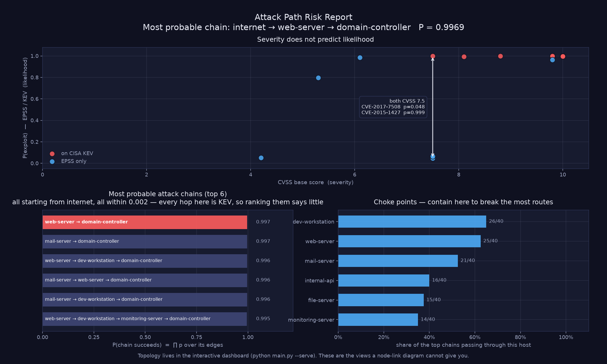

# Graph-Based Attack Path Modeler

Turns vulnerability scan data into a directed attack graph, ranks the chains an attacker is most likely to complete, finds the hosts that most of those chains run through, and trains a graph neural network to predict which lateral-movement edges lie on an optimal route to a crown-jewel asset.

Exploitability comes from **EPSS** and **CISA KEV** rather than CVSS alone, edge weights are `-log(P(exploit))` so a path's cost is a probability, and every model is reported next to the baselines it has to beat.

**[→ Open the live dashboard](https://nicky-quist.github.io/attack-path-modeler/)**

The hosted copy runs the real analysis output for the sample estate: zone lanes, the
ranked chain, the choke points, every host's CVEs. It is the committed
[`data/graph.json`](data/graph.json), produced by the pipeline in this repo.

What the hosted copy *cannot* do is build a new graph, because that means calling NVD,
EPSS and CISA KEV and running the ranking in Python, and GitHub Pages serves static files
only. [`builder.html`](builder.html) says so plainly when you open it there. Clone and run
`python main.py --serve` and the same page builds graphs for real.

---

## What it does

- **Nessus parser** — ingests `.nessus` XML and extracts hosts, CVEs, CVSS, ports, services
- **Known-CVE input** — no scan? Type hosts and CVE IDs; CVSS is pulled live from the [NVD API](https://nvd.nist.gov/developers), from the terminal (`main_from_cves.py`) or the browser (`builder.html`)
- **Real exploitability** — [EPSS](https://www.first.org/epss/) probability per CVE, floored by presence in the [CISA KEV catalogue](https://www.cisa.gov/known-exploited-vulnerabilities-catalog); both cached, both degrading to a CVSS estimate offline
- **Segmentation-aware graph** — an edge exists only where firewall policy permits the source zone to reach a port the target is actually vulnerable on
- **Probabilistic path ranking** — Dijkstra over `-log(p)` weights returns the *most probable* attack chain, with its end-to-end success probability
- **Choke-point analysis** — hosts ranked by the share of top attack chains that traverse them
- **Edge-risk GNN** — a 3-layer GCN predicting whether an edge lies on an optimal route to a crown jewel, benchmarked against three baselines
- **Two complementary views** — an interactive D3 dashboard for topology, and a static risk report answering what a node-link drawing cannot: does severity predict exploitation, how do the chains rank, which host do you contain

---

## Results

Five independent synthetic estates, a fresh train/test split each, mean ± sd of test-set F1. Reproduce with `python experiments/benchmark.py`.

| Model | F1 | What it tells you |
|---|---|---|
| majority class | 0.000 ± 0.000 | the floor — 80% of edges are negative |
| `max_cvss > 8.5` on the target | 0.560 ± 0.182 | a single threshold on one node feature |
| logistic regression, no graph | 0.768 ± 0.107 | same features, both endpoints, no message passing |
| **GCN (3-layer)** | **0.911 ± 0.151** | **+0.143 over the no-graph model** |

Graphs average 71 nodes and 766 edges at 19.6% positive.

The number that matters is the gap between the last two rows. Both models see identical node features; only the GCN can aggregate across the topology, and that is worth roughly fourteen F1 points. The spread (± 0.151) is real — the GCN scored a perfect 1.000 on three of the five seeds and only 0.652 on another — and is reported rather than smoothed away.

---

## Why the weights are `-log(p)`

The original version weighted edges `1 / CVSS` and summed along a path. That total is not a quantity of anything: adding reciprocals of severity scores yields a number with no units and no interpretation.

Weighting by `-log(P(exploit))` makes the sum meaningful:

```
cost(path) = Σ -log(pᵢ) = -log(∏ pᵢ)      ⟹      P(chain succeeds) = e^(-cost)
```

So the minimum-cost path Dijkstra returns *is* the most probable attack chain, and its cost converts directly back into a probability. Same algorithm, one changed line, and the output becomes something you can defend in a room.

### CVSS is severity, not likelihood



The top panel is the claim this project rests on, drawn from the sample scan. Two CVEs
sit at the same **CVSS 7.5** with exploitation probabilities of 0.048 and 0.999:

| CVE | CVSS | P(exploit) | Source |
|---|---|---|---|
| CVE-2017-7508 | 7.5 | **0.048** | EPSS |
| CVE-2015-1427 | 7.5 | **0.999** | CISA KEV — actively exploited |

CVSS ranks these identically. One is twenty times less likely to be used against you than the other is certain to be. Any model built on CVSS alone cannot see that difference; this one prices it directly into the path cost.

---

## The prediction target, and why the previous one was wrong

**The original label was broken, and the fix is the most important change in this project.**

It was:

```python
label = 1 if G.nodes[tgt]["max_cvss"] > 8.5 else 0
```

while `max_cvss` was simultaneously node feature 0, handed to the classifier raw through the skip connection. The label was a deterministic function of an input. A one-line threshold rule with no model at all scored **100% accuracy** on it.

The perfect precision and recall the old README reported were not evidence of learning. They were the only achievable outcome, and no quantity of real scan data would have changed that — the task was unlearnable-by-construction. This is the kind of defect that survives review precisely because the numbers look excellent.

The replacement asks something a node cannot answer about itself:

> Does this edge lie on an **optimal route** from where it starts to a crown-jewel asset?

Formally, for edge `(u, v)` with `d(x)` the cheapest cost from `x` to any crown jewel:

```
label(u, v) = 1   iff   w(u, v) + d(v) ≤ d(u) + tolerance
```

That is the Bellman optimality condition on the attack graph — it marks the edges an optimal attacker would actually traverse. `d(u)` and `d(v)` are global quantities defined by the whole downstream topology and the location of assets the node has no local knowledge of, so predicting it requires aggregating information across the graph. That is the entire justification for using a GNN, and the old label did not require it.

**An honest caveat.** The new label still *correlates* with local exploitability, and it should — an optimal attacker move does tend toward hosts that are easy to exploit. An oracle-tuned CVSS threshold reaches F1 0.60–0.88 on it. What no longer happens is *recovery*: no threshold reproduces the label outright. The distinction between correlation and recovery is the difference between a hard task and a fake one, and `tests/test_leakage.py` enforces it.

---

## Segmentation: why the graph is no longer complete

The original builder connected every host to every other host in its subnet, giving a complete digraph — density 0.500 on the synthetic set. Two consequences:

- **Choke-point analysis returned nothing.** In a complete subgraph the shortest route between any two hosts is the direct edge, so nothing routes through anyone. Betweenness centrality scored **1 node out of 100** above zero, and that node was the gateway the code had hardcoded. The algorithm was rediscovering a constant.
- **Message passing over-smoothed**, which the old code worked around with a skip connection rather than fixing the cause.

An edge now requires *reachability to a vulnerable service*: policy must permit the source zone to reach a port, and the target must actually be vulnerable on that port. Density drops from 0.500 to 0.167, and choke points become readable:

```
Choke points — share of the top attack chains passing through:
  dev-workstation       65.0%  (26/40 chains)
  web-server            62.5%  (25/40 chains)
  mail-server           52.5%  (21/40 chains)
```

That reads as *"containing this host breaks 26 of the 40 most probable routes to your crown jewels"* — a sentence a defender can act on. Plain betweenness could not produce it.

Policy lives in [`data/segmentation.json`](data/segmentation.json):

```json
{
  "zones":  { "dmz": ["10.0.0.0/24"], "internal": ["10.0.1.0/24"] },
  "rules": [
    { "from": "internet", "to": "dmz",      "ports": [443, 8080, 25, 143, 1194] },
    { "from": "dmz",      "to": "internal", "ports": [445, 3389, 389] }
  ],
  "entry_points": ["internet"],
  "crown_jewels": ["10.0.1.4"]
}
```

If no policy file matches the hosts, one is synthesised (a zone per /24, gateways bridging outward). A policy written for a *different* estate is detected by coverage check and rejected rather than obeyed — otherwise it silently produces an empty graph, which is a wrong answer wearing the costume of a right one.

---

## Installation

```bash
pip install -r requirements.txt
```

`networkx`, `matplotlib`, `torch`, `torch-geometric`. No other dependencies — the EPSS and KEV clients use `urllib`, and the logistic-regression baseline is a single `torch.nn.Linear` rather than a scikit-learn import.

## Usage

```bash
python main.py                    # Nessus scan, live EPSS + KEV, risk report window
python main.py --serve            # also open the interactive D3 dashboard in a browser
python main.py --offline          # no network; CVSS-derived estimates
python main.py --save-plot        # write the report to attack_path_report.png
python main.py --graph-plot       # the static node-link diagram instead of the report
python main.py --no-plot          # no figure at all
python main.py --skip-gnn         # skip model training
```

**The two views do different jobs.** The dashboard owns topology, because that is
what interaction helps with — drag nodes apart, hover an edge for the CVE behind it.
The static report answers what a node-link drawing is bad at: whether severity
predicts exploitation, how the chains rank against each other, and which host to
contain. `--graph-plot` still renders the node-link diagram if you want a static
topology picture without starting a server, but it is not the default, because
duplicating the dashboard in a window you cannot interact with is not a second view.

### The dashboard draws the segmentation policy

Hosts are laid out in **lanes, one per zone, ordered by attacker depth** — a breadth-first
walk from the internet-facing hosts, so one lane to the right is one segmentation boundary
crossed. Node x is clamped to its lane rather than nudged toward it: a node drifting into
the neighbouring lane would make the whole layout lie about the policy.

That turns the left-to-right axis into the thing the JSON policy file asserts but never
shows. The rest follows from it — the red chain visibly crosses two boundaries to reach
the crown jewel, and the hosts every route funnels through are the ones the choke-point
panel names.

Colour and size are `P(exploit)`, never CVSS, so the dashboard cannot quietly contradict
the claim the project rests on. A red ring means the host carries a CVE on the CISA KEV
list; an amber halo means it is a crown jewel. Selecting a host dims everything outside
its neighbourhood and opens a panel with its CVEs, its ways in, and its ways onward.

Both browser views share one stylesheet (`assets/app.css`), and `src/report.py` draws with
the same tokens, so the report and the two pages are one tool rather than three dark themes
that happen to share a hue.

```bash
python main_from_cves.py                  # uses data/known_hosts.json
python main_from_cves.py path/to/spec.json
python main_from_cves.py --interactive    # type hosts and CVEs at the prompt
python main_from_cves.py --policy data/my_segmentation.json
```

```bash
python experiments/benchmark.py     # the results table above
python -m unittest discover -s tests -t .
```

Sample output:

```
Most probable attack chain:
  internet -> web-server -> domain-controller
  P(success) = 0.9969   cost = 0.0031   hops = 2
    internet     -> web-server          CVE-2021-44228 via https/443  p=0.9990 (kev)  [KEV]
    web-server   -> domain-controller   CVE-2021-34527 via smb/445    p=0.9979 (kev)  [KEV]
```

---

## Project structure

```
attack-path-modeler/
├── src/
│   ├── parser.py           # Nessus XML -> hosts
│   ├── cve_lookup.py       # NVD API: CVE ID -> CVSS
│   ├── exploitability.py   # EPSS + CISA KEV -> P(exploit)
│   ├── segmentation.py     # zone/port policy, coverage checking
│   ├── graph.py            # reachability-gated graph, -log(p) weights
│   ├── labels.py           # Bellman-optimality edge label
│   ├── features.py         # node features (shared by every model)
│   ├── baselines.py        # majority / CVSS threshold / logistic regression
│   ├── gnn.py              # 3-layer GCN edge classifier + comparison
│   ├── analysis.py         # path ranking, choke points
│   ├── report.py           # severity-vs-likelihood, chain ranking, choke points
│   ├── synthetic.py        # segmented synthetic estate
│   ├── metrics.py          # precision / recall / F1
│   ├── export.py           # JSON for the D3 dashboard
│   └── serve.py            # local server for builder.html
├── experiments/benchmark.py  # multi-seed evaluation
├── tests/                    # 28 tests, incl. leakage regressions
├── data/
│   ├── sample.nessus
│   ├── segmentation.json
│   └── known_hosts*.json
├── assets/app.css            # design tokens shared by both pages and report.py
├── main.py
├── main_from_cves.py
├── index.html                # GitHub Pages entry point -> dashboard
├── dashboard.html            # zone-lane attack graph, chain, choke points
└── builder.html              # build a graph from typed CVE IDs
```

The two pages are plain static files reading `data/graph.json`, which is what lets
GitHub Pages serve them unchanged from the repo root — no build step, no bundler,
and the same files the local server serves.

---

## Tests

```bash
python -m unittest discover -s tests -t .
```

28 tests. The ones worth naming are in [`tests/test_leakage.py`](tests/test_leakage.py), because they encode the two defects that made the original results meaningless:

- **`test_threshold_on_target_cvss_does_not_solve_the_task`** — fails if the label ever again becomes recoverable from a single node feature
- **`test_message_passing_excludes_test_edges`** — fails if held-out edges are ever again propagated through the network before being scored (the original trained message passing over the full edge set, then evaluated on edges inside it)
- **`test_label_depends_on_graph_not_just_endpoints`** — fails if every edge into a given host shares a label, which would mean the topology is decorative
- **`test_forbidden_features_absent`** — fails if `is_crown_jewel` or any distance-to-asset quantity enters the feature set

Writing these first would have caught the original bug. They exist now so it cannot come back quietly.

---

## What this does and doesn't prove

**It does show** that on a segmented synthetic estate, a graph neural network predicts optimal-route membership meaningfully better than a linear model given identical node features (F1 0.911 vs 0.768 over five independent networks), and that the improvement comes from message passing rather than from the label leaking into an input.

**It does not show** anything about a real network. The synthetic estate is generated by rules I wrote, and those rules decide the answer as much as the model does. Real scan data is noisier, real segmentation is messier and partly undocumented, and real asset criticality is rarely as clean as a per-zone constant.

The CVEs in the synthetic set are fabricated, so EPSS has no scores for them and exploitability there falls back to a CVSS-derived estimate — the results table is a statement about the model, not about exploitation in the wild. The EPSS and KEV integration is exercised for real only on the Nessus and known-CVE paths, where the CVEs exist.

The `-log(p)` path probabilities inherit every assumption EPSS makes, and treat hops as independent, which they are not: an attacker who has already compromised one host is not facing baseline odds on the next. The numbers are a ranking signal, not a forecast.

**Next:** validating against real scan data from a lab estate; modelling hop dependence instead of assuming independence; and per-CVE MITRE ATT&CK technique mapping so an edge carries the technique it represents, not just the CVE.
